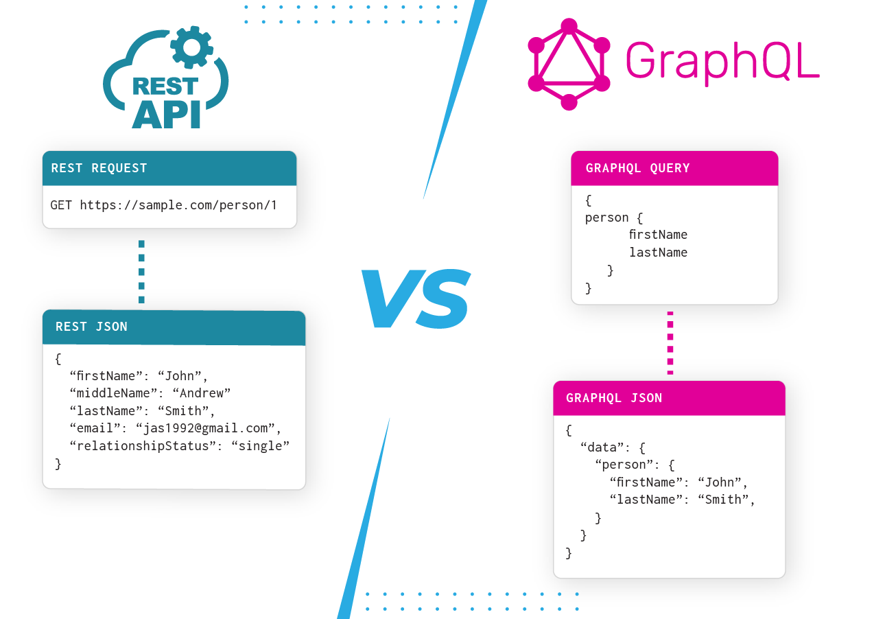

# API - Acceso a Datos
Sencilla API para ser consumida siguiendo REST o GraphQL

[](https://www.typescriptlang.org/)
[](https://hub.docker.com/r/joseluisgs/api-acceso-datos)
[](https://api-acceso-datos.herokuapp.com/)
[](https://airbnb.io/javascript)
[](./LICENSE)


- [API - Acceso a Datos](#api---acceso-a-datos)
  - [Acerca de](#acerca-de)
    - [Documentación](#documentación)
    - [Relaciones](#relaciones)
      - [Departamento](#departamento)
      - [Programador](#programador)
  - [Consumo de la API](#consumo-de-la-api)
    - [Cliente GraphQL - Apollo Client](#cliente-graphql---apollo-client)
    - [Cliente REST](#cliente-rest)
  - [Despliegue](#despliegue)
    - [Docker](#docker)
    - [Heroku](#heroku)
    - [Con NodeJS](#con-nodejs)
      - [Instalación](#instalación)
      - [Construcción](#construcción)
      - [Ejecución](#ejecución)
      - [Ejecución Modo Dev](#ejecución-modo-dev)
      - [Ejecución con Nodemon](#ejecución-con-nodemon)
      - [Linter](#linter)
  - [Postman](#postman)
  - [Extensiones de interés](#extensiones-de-interés)
  - [Autor](#autor)
    - [Contacto](#contacto)
  - [Licencia](#licencia)


## Acerca de
Esta sencilla API con usos docentes será utilizada para consumir y manipular información en Acceso a Datos mediante REST o GraphQL usando distintos clientes. de esta manera podrás ver como funcionan estas dos modalidades de consumir datos bajo un servicio web y decidir cuál de ellas se adapta mejor a tus proyectos, puedes elegir entre las dos, o las dos a la vez según tus necesidades.

### Documentación
La documentación de la API esta disponible en [este enlace](https://documenter.getpostman.com/view/11271351/UV5agGTC) o desde http://url:port/doc, por ejemplo: http://localhost:4000/doc o https://api-acceso-datos.herokuapp.com/


### Relaciones
- Un Departamento tiene una  lista de programadores (uno a muchos). Además tiene un programador que es Jefe de dicho Departamento (uno a uno)
- Los Programadores pertenecen a un departamento (muchos a uno), tiene un perfil (FrontEnd, BackEnd o FullStack) y domina una lista de lenguajes: Java, TypeScript, NodeJS, VueJS).

#### Departamento
- id: ID! (uuidv4)
- nombre: String! Nombre del Departamento
- presupuesto: Float! Presupuesto anula asignado
- jefe: Programador! Relación con Programador 1-1: id de Programador que dirige el Departamento
- programadores: [Programador] Lista de id de Programadores que están asociados al Departamento

#### Programador
- id: ID! (uuidv4)
- nombre: String! Nombre del programador
- experiencia: Int! Años de experiencia
- salario: Float! Salario anual recibido
- perfil: Perfil! (FullStack, BackEnd, o FrontEnd)
- departamento: String! Relación con Departamento, id deDepartamento.
- fechaAlta: DateTime! Fecha de alta en nuestra empresa
- lenguajes: Lista de lenguajes que domina: Java, TypeScript, NodeJS, VueJS


## Consumo de la API
Puedes consumir esta API usando un cliente REST o GraphQL que desees.



### Cliente GraphQL - Apollo Client
Puedes usar el propio cliente Apollo para hacer tus consultas desde el endpoint de la API: http://url:port/graphql, por ejemplo: http://localhost:4000/graphql o https://api-acceso-datos.herokuapp.com/graphql. También puedes usar Postman y el fichero con ejemplos de la carpeta postman.

### Cliente REST
Puedes usar tu cliente rest favorito para hacer tus consultas desde el endpoint de la API: http://url:port/rest, por ejemplo: http://localhost:4000/rest. También puedes usar Postman y el fichero con ejemplos de la carpeta postman.

## Despliegue
### Docker
Puedes desplegar la API usando Docker, a partir de la siguiente [imagen](https://hub.docker.com/r/joseluisgs/api-acceso-datos), de la siguiente manera
```bash
docker run -it -p 4000:4000 --rm --name api-acceso-datos joseluisgs/api-acceso-datos
```
### Heroku
La api está desplegada en Heroku, en el siguiente enlace: https://api-acceso-datos.herokuapp.com/

### Con NodeJS
#### Instalación
```bash
npm install (si da error usa npm install --force)
```

#### Construcción
```bash
npm run build
```

#### Ejecución
```bash
npm start (si da error npm run dev:run)
```

#### Ejecución Modo Dev
```bash
npm run dev
```

#### Ejecución con Nodemon
```bash
npm run dev:watch
```

#### Linter
```bash
npm run lint
o
npm run lint:fix
```
## Postman
Se incluye el fichero para usar y ver las consultas con [Postman](https://www.postman.com/). Con este cliente podrás hacer tus peticiones REST y GraphQL a nivel local.


## Extensiones de interés
- GraphQL: Para visualizar y lanzar tus consultas GraphQL.
- ThunderClient: Para visualizar y lanzar tus consultas REST.

## Autor
Codificado con :sparkling_heart: por [José Luis González Sánchez](https://twitter.com/joseluisgonsan)

[](https://twitter.com/joseluisgonsan)
[](https://github.com/joseluisgs)

### Contacto
<p>
  Cualquier cosa que necesites házmelo saber por si puedo ayudarte 💬.
</p>
<p>
    <a href="https://twitter.com/joseluisgonsan" target="_blank">
        
    </a> &nbsp;&nbsp;
    <a href="https://github.com/joseluisgs" target="_blank">
        
    </a> &nbsp;&nbsp;
    <a href="https://www.linkedin.com/in/joseluisgonsan" target="_blank">
        
    </a>  &nbsp;&nbsp;
    <a href="https://joseluisgs.github.io/" target="_blank">
        
    </a>
</p>


## Licencia

Este proyecto esta licenciado bajo licencia **MIT**, si desea saber más, visite el fichero
[LICENSE](./LICENSE) para su uso docente y educativo.
